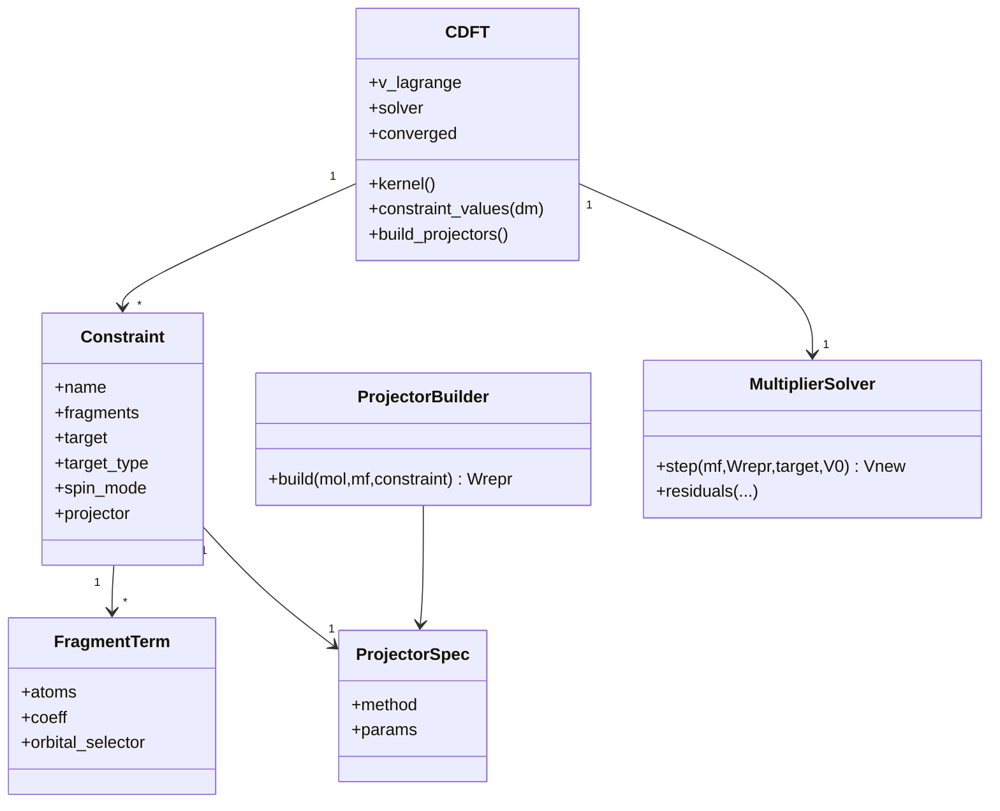

# Drafting a Specification to Implement Constrained Density Functional Theory in PySCF

## Executive summary

Constrained density functional theory (cDFT) augments standard Kohn–Sham DFT by introducing one or more **constraint functionals** (typically fragment electron counts or charge differences) enforced via **Lagrange multipliers**. In the canonical modern formalism, the constrained solution is obtained as a **minimization with respect to the density (or orbitals)** and a **maximization with respect to the constraining potential(s)**, yielding a saddle-point problem. citeturn41view1turn41view2turn41view3turn38search3

A robust PySCF implementation should (i) represent constraints through AO-basis **projector/weight matrices** \(W_I\) such that each constrained observable is a trace \(\mathrm{Tr}[D W_I]\), (ii) provide multiple “population” definitions (Mulliken/Löwdin/IAO-based, localized-orbital subspace projectors, and real-space weight-function schemes analogous to Becke partitions), and (iii) offer multiple multiplier solvers: a fast **nested “micro-iteration”** root solve per SCF cycle (as in the Van Voorhis “direct optimization” strategy), plus a more advanced **coupled Newton–KKT** second-order solver for difficult cases. citeturn38search1turn38search3turn27view0turn31view0

A high-value architectural target is **API compatibility** with the emerging GPU ecosystem. GPU4PySCF already implements a cDFT UKS workflow using (a) “microiterations” with a root solve for multipliers during Fock construction and (b) a coupled Newton–KKT solver with a trust-region strategy and MINRES linear solves, including MINAO-style projector construction and an optional Becke-grid projector path. This provides a concrete reference design for PySCF’s CPU implementation and a roadmap for GPU friendliness. citeturn17view0turn27view0turn26view0turn31view0turn22view0

The implementation specification below prioritizes three charge-constraint types you requested—(1) electrons in an atom region, (2) net charge in an atom region, (3) charge difference between two atom groups—implemented via a unified “linear combination of fragment populations” interface. This mirrors long-standing conventions in other codes (e.g., NWChem’s group/operator model and Conquest’s “absolute vs difference” selection). citeturn4view1turn5view0turn33view0

## Background and key equations

### Core saddle-point formulation and weight functions

A standard statement of cDFT is: find the lowest-energy state consistent with a constraint on an integrated density property, enforced with a Lagrange multiplier. For the simplest form “there are \(N\) electrons in a spatial region \(\Omega\)”, the constrained energy is written as a min–max (saddle point): citeturn41view1turn41view2
\[
E(N)=\min_{\rho}\max_{V}\Big(E[\rho]+V\big(\int_{\Omega}\rho(\mathbf r)\,d^3r-N\big)\Big).
\]
The review formalism generalizes this by introducing a (possibly spin-dependent) **weight function** \(w^\sigma(\mathbf r)\) and writing a unified constrained functional \(W[\rho,V;N]\) with the constrained observable \(\sum_\sigma\int w^\sigma(\mathbf r)\rho^\sigma(\mathbf r)\,d^3r\). citeturn41view2turn41view3

For fragment charge constraints used in chemistry, one typically defines an “electron population on fragment \(A\)” as
\[
N_A=\int w_A(\mathbf r)\rho(\mathbf r)\,d^3r,
\]
where \(w_A(\mathbf r)\) partitions space among atoms/fragments (e.g., Voronoi-like, Becke weights, or other prescriptions). citeturn41view4
This makes nearly all “charge constraints” special cases of choosing an appropriate partition \(w(\mathbf r)\) and target value. citeturn41view4

### Van Voorhis “direct optimization” strategy in practice

The original Van Voorhis line of work emphasizes that the constrained state is a saddle point: **minimum with respect to the density/orbitals but maximum with respect to the constraint potential**, and that this leads to efficient algorithms that optimize the constraint potential during SCF. citeturn38search3turn38search1

In the “direct optimization” style described in the early papers, the constraining potential (the multipliers) can be optimized “inside” each SCF iteration, i.e., a small-dimensional nonlinear solve for \(V\) is nested inside the usual fixed-point iteration for the density. This approach extends naturally to **multiple constraints**, and was used to analyze long-range charge-transfer states and size-consistency behavior. citeturn38search1turn38search3

These ideas are now widespread across codes: nested multiplier optimization, Newton-style updates on multipliers, and penalty alternatives all trace back to the same saddle-point structure (min over orbitals, max over multipliers). citeturn41view2turn41view3turn38search3

## Constraint types to support and unified mathematical representation

### Unifying representation: linear constraints as traces with projectors

For an AO-basis code like PySCF, the most implementation-friendly representation is:
- Construct one or more AO-basis matrices \(W_I\) (dense or low-rank) such that the constrained observable is
  \[
  C_I(D)=\mathrm{Tr}[D W_I],
  \]
  where \(D\) is the (spin-summed or spin-resolved) AO density matrix (or matrices for UKS). This matches the practical approach in GPU4PySCF, which evaluates populations via traces \( \mathrm{Tr}[D_\alpha W]+\mathrm{Tr}[D_\beta W] \) (charge) or \( \mathrm{Tr}[D_\alpha W]-\mathrm{Tr}[D_\beta W] \) (spin). citeturn27view0turn26view0turn22view0

Then enforce \(C_I(D)=C_I^{\mathrm{target}}\) by adding a constraint potential to the Fock/Kohn–Sham operator:
\[
F^{\mathrm{(constr)}} = F^{(0)} + \sum_I V_I W_I,
\]
with \(V_I\) updated until the constraint residuals vanish (or become sufficiently small). This is explicitly how GPU4PySCF builds the constraint potential and injects it into the Fock construction. citeturn26view0turn27view0

### Constraint type: total electrons in an atom region

Interpretation: “The fragment contains \(N_A^{\mathrm{target}}\) electrons.” Using a fragment projector \(W_A\),
\[
N_A(D)=\mathrm{Tr}[D W_A] \stackrel{!}{=} N_A^{\mathrm{target}}.
\]
This corresponds directly to the canonical “\(\int_\Omega \rho = N\)” constraint when \(W_A\) is derived from a spatial weight \(w_A(\mathbf r)\). citeturn41view1turn41view4

### Constraint type: net charge in an atom region

Net charge is typically defined as nuclear charge minus electron population:
\[
Q_A = Z_A - N_A.
\]
So constraining net charge to \(Q_A^{\mathrm{target}}\) is equivalent to constraining electrons to
\[
N_A^{\mathrm{target}} = Z_A - Q_A^{\mathrm{target}}.
\]
This is important for UX: user-facing input can specify either “charge” or “electrons”; internally, treat it uniformly as a constraint on electrons \(N_A\). This is consistent with documentation in other codes (e.g., Q-Chem-style descriptions that “charge constraints are on net atomic charge,” which implies a conversion to electron populations under the hood). citeturn11search5turn41view4

### Constraint type: charge difference between two atom groups

A charge-difference constraint is naturally a linear combination of populations:
\[
\Delta N_{A-B}(D)=N_A(D)-N_B(D)=\mathrm{Tr}[D (W_A - W_B)].
\]
Thus it is implemented by a single effective projector \(W_\Delta=W_A-W_B\) with target \(\Delta N^{\mathrm{target}}\). This structure also mirrors Conquest’s explicit distinction between “absolute charge on groups” and “difference between two groups.” citeturn33view0turn41view4

This “linear combination” design generalizes to many constraints and simplifies the user interface: each constraint is a (small) list of **fragments** with coefficients (e.g., +1 and −1), a target value, and a projector definition.

## Expressing constraints using population analysis and localization options in PySCF

PySCF provides a rich localized-orbital toolkit (Boys, Pipek–Mezey, Edmiston–Ruedenberg, intrinsic atomic orbitals, etc.) and multiple population definitions (Mulliken, (meta-)Löwdin, IAO/IBO perspectives). A cDFT spec should treat these as **projector backends** that generate \(W\) matrices (or low-rank equivalents). citeturn43view0turn41view4

### Mulliken population as a constraint projector

A Mulliken-like gross population on an atom group can be expressed in AO matrix form as a trace involving the overlap \(S\) and a basis-function selector \(T_A\) (diagonal matrix selecting AOs on atoms in group \(A\)). A numerically stable symmetric choice is
\[
W_A^{\mathrm{(Mull)}}=\tfrac12(S T_A + T_A S),
\quad
N_A=\mathrm{Tr}[D W_A^{\mathrm{(Mull)}}],
\]
which avoids dependence on asymmetric products when using symmetric densities. This falls under the general “population prescription” idea in which atomic populations can be written as \(\int w_A(\mathbf r)\rho(\mathbf r)d^3r\), but realized in AO space rather than real space. citeturn41view4

Practical caution: other codes explicitly warn Mulliken populations can behave poorly (especially with diffuse basis functions), motivating better projector choices like smooth real-space partitions or orthogonalized populations. For example, NWChem’s cDFT documentation notes Mulliken is “not recommended,” and that Becke is recommended for diffuse basis functions. citeturn5view0turn4view1

### Löwdin (and meta-Löwdin) populations

Löwdin populations are obtained by symmetric orthogonalization and then taking diagonal populations in the orthogonal basis. In projector form:
\[
W_A^{\mathrm{(Lowdin)}} = S^{1/2} T_A S^{1/2},
\quad
N_A=\mathrm{Tr}[D W_A^{\mathrm{(Lowdin)}}].
\]
PySCF’s localization documentation explicitly discusses (meta-)Löwdin orbitals and that multiple population choices exist for PM-style localizations. citeturn43view0
NWChem also includes “LOWDIN” as a supported cDFT population choice and sets it as the default in its cDFT module, giving it practical precedent as a stable default. citeturn4view1turn5view0

### Intrinsic atomic orbitals (IAOs) and IBO-style charge partitions

The PySCF localized-orbital documentation notes that intrinsic bond orbitals (IBOs) can be seen as a special case of Pipek–Mezey localization using IAOs as the population method, and cites IAOs as a core building block of that perspective. citeturn43view0

For cDFT, IAOs suggest a clean projector strategy: define an orthonormal localized atomic subspace \(C_{\mathrm{IAO}}\) (in AO coefficients, orthonormal in \(S\)), and build a projector for any subset \(K\) (atoms/group) as a **subspace projector**:
\[
W_K = S\,C_K C_K^\dagger\,S,
\]
which is exactly the same structural form used in GPU4PySCF’s MINAO-based projectors (see below). citeturn26view0turn27view0
This approach is attractive because it yields:
- a well-defined fragment subspace even with diffuse functions,
- potential for **low-rank** representations (store \(S C_K\) instead of full \(W_K\)),
- straightforward evaluation of occupancies and (with more work) analytic derivatives.

### Localized molecular orbitals as projector-defined fragments

PySCF documents several iterative orbital localization criteria: Boys (minimizes orbital spread), Pipek–Mezey (maximizes locality based on atomic populations), and Edmiston–Ruedenberg (maximizes Coulomb self-repulsion). citeturn43view0
These allow an alternative constraint paradigm: constrain the **occupancy of a chosen localized-orbital subspace** rather than a spatial fragment defined by atomic weights. In the unified trace form, if \(C_{\mathrm{loc}}\) are orthonormal localized orbitals, and \(C_K\) selects the orbitals assigned to a fragment, then
\[
W_K = S\,C_K C_K^\dagger\,S,\quad N_K=\mathrm{Tr}[D W_K].
\]
This is especially useful for:
- charge-transfer problems where diabatic states correspond naturally to localized donor/acceptor orbitals,
- constraints defined on chemically meaningful orbital groups (e.g., a metal \(d\)-manifold or a conjugated subunit),
- projector rationales similar to DFT+U.

### Projector-based “MINAO” subspace scheme and real-space Becke partitions

GPU4PySCF implements two major “projection_method”s for cDFT UKS: `minao` and `becke`. citeturn24view2turn27view0turn22view0

**MINAO-style subspace projector (recommended default in GPU4PySCF):**
GPU4PySCF constructs constraint projectors \(W\) using an orthogonalized minimal basis reference and a projected Löwdin-like orthogonalization, following the same logic as its DFT+U implementation. It builds \(SC = S C_{\mathrm{minao}}\), selects columns corresponding to a chosen atom or orbital label set, and forms \(W = (SC)(SC)^\dagger\). citeturn26view0turn25view2turn27view0
This yields robust projectors and enables orbital-specific constraints (via AO label selection) in that scheme. citeturn26view0turn24view2
GPU4PySCF’s example script shows constraints specified as target electron populations on particular atoms (e.g., O constrained to 8.1 electrons), and populations are verified by traces against the built projectors. citeturn22view0turn21view1

**Becke real-space weight projectors (grid-based):**
GPU4PySCF also provides a Becke partition option that builds AO-space projectors by numerical quadrature:
\[
W_A = \int w_A(\mathbf r)\,\phi(\mathbf r)\phi(\mathbf r)^\top\,d^3r,
\]
implemented by looping over grid blocks, computing Becke weights per atom, weighting AO values on the grid, and accumulating \(W_A \mathrel{+}= \Phi^\top (w_A \odot \Phi)\). citeturn26view0turn41view4
It explicitly restricts Becke projection to atom-based constraints (no orbital-label constraints in that mode). citeturn26view0turn25view1

This split strongly suggests a PySCF spec should support both:
- **subspace projectors** (MINAO/IAO/localized orbitals) as the default robust approach,
- **real-space weight partitions** (Becke, optionally Hirshfeld-like) for users who want a spatial definition closer to the original population-weight formulation. citeturn41view4turn26view0

## Survey and comparison of implementations in NWChem, Conquest, and GPU4PySCF

### User-facing constraint specification and supported partitions

NWChem’s cDFT interface is oriented around defining **groups** and one (or more) **operators** that constrain the “charge” on those groups. The manual shows a `cdft` block with `group` directives listing atoms, and `operator` directives specifying constraints (including two-group charge-difference style operators). citeturn4view1turn5view0
NWChem supports several population schemes for cDFT including `becke`, `lowdin` (default), and `mulliken`, with explicit documentation guidance that Becke is recommended for diffuse basis functions and Mulliken is not recommended. citeturn5view0turn4view1

Conquest exposes cDFT via input tags: a top-level enable flag, a `Type` selecting **absolute charge on groups** vs **difference between two groups**, plus `MaxIterations`, `Tolerance`, and atom-group block definitions. citeturn33view0turn35view0
Conquest’s public repository README explicitly lists “delta-SCF and cDFT calculations” as available capabilities. citeturn36view0
The Conquest cDFT paper abstract notes the code chooses the **Becke weight population scheme** specifically because it enables forces to be calculated analytically and efficiently in a linear-scaling code. citeturn9search21

GPU4PySCF adds cDFT to GPU UKS with nested microiterations for multipliers and supports at least two projector schemes (`minao` and `becke`) and two enforcement methods (Lagrange multipliers and a quadratic penalty alternative). citeturn17view0turn26view0turn27view0turn22view0

### Architecture, data structures, and solver strategy comparison

The table below consolidates the most implementation-relevant traits that are explicitly documented in accessible primary/official sources.

| Aspect | NWChem | Conquest | GPU4PySCF |
|---|---|---|---|
| Code architecture context | Large electronic-structure package; DFT uses Gaussian basis set approach. citeturn11search20turn2search17 | Local-orbital code supporting diagonalization and linear scaling; heavy use of localized support functions / density-matrix form in LS mode. citeturn34view0turn7search14turn36view0 | GPU-accelerated PySCF stack using CuPy arrays and GPU kernels. cDFT integrated into UKS class by overriding SCF routines. citeturn27view0turn22view0turn17view0 |
| Constraint types exposed | Groups + operators (including multi-group / difference-style). citeturn4view1turn5view0 | `cDFT.Type`: absolute group charge vs difference between two groups. citeturn33view0turn35view0 | Charge constraints and spin constraints supported; charge and spin handled by ± sign across alpha/beta channels. citeturn27view0turn24view2 |
| Partition / population schemes | `becke`, `lowdin` (default), `mulliken`; explicit guidance about stability for diffuse basis. citeturn5view0turn4view1 | Documentation strongly oriented around atom-group definitions; Conquest supports Becke weights for charge analysis elsewhere, and cDFT literature notes Becke weights chosen for cDFT. citeturn35view3turn9search21 | `projection_method='minao'` (subspace projector) vs Becke weight projectors. Becke path constructed by grid partition and AO quadrature. citeturn26view0turn27view0turn25view1 |
| Multiplier update scheme | Manual describes user control and options; public manual excerpt here does not detail solver internals, but operationally suggests iterative enforcement within SCF. citeturn4view1turn5view0 | User tags include MaxIterations and constraint tolerance, strongly indicating an outer loop over cDFT iterations. citeturn33view0turn35view0 | Default “microiterations”: each SCF cycle calls a root solver (`scipy.optimize.root`, method `hybr`) to solve for multipliers using a function that diagonalizes \(F+V\) and measures constraint residuals. citeturn27view0turn26view0 |
| Second-order / Newton options | Not described in the extracted section. citeturn4view1turn5view0 | Not described in the extracted doc sections beyond iterative controls. citeturn35view0 | Provides a coupled Newton–KKT solver (`newton()`) optimizing orbitals and multipliers simultaneously using MINRES + trust region; penalty method has a distinct second-order path with Hessian correction. citeturn32view0turn31view0turn29view2 |
| Convergence criteria | User controls include population scheme choice; typical SCF convergence plus constraint satisfaction implied. citeturn4view1turn5view0 | Explicit cDFT tolerance parameter for constraint convergence. citeturn33view0turn35view0 | Micro-iteration tolerance and max function evaluations (`micro_tol`, `micro_max_cycle`), plus standard SCF convergence; Newton–KKT uses gradient norm, max constraint residual, and energy change with trust-radius adaptation. citeturn24view1turn31view0turn30view1 |

### Numerical “tricks” and operational lessons evident in public artifacts

- NWChem community reports include failure modes like “multipliers go over limit” when using Becke populations, illustrating the importance of multiplier step control, bounds, and robust fallback strategies. citeturn11search13
- GPU4PySCF’s design includes (i) an explicit penalty alternative, and (ii) a trust-region Newton–KKT solver using an iterative linear solver and an explicit Schur-complement-like preconditioner, suggesting these were introduced to address convergence robustness beyond fixed-step Newton updates. citeturn22view0turn31view0turn18view0
- Conquest’s emphasis on Becke weights for analytic forces in a linear-scaling context highlights a practical constraint: the “definition of charge” must be compatible with efficient force evaluation and the underlying sparse/local data structures. citeturn9search21turn7search14

## Proposed PySCF API and internal architecture specification

This section proposes a **first-class, testable, extensible** cDFT subsystem in PySCF that (a) supports your requested constraint types, (b) maps cleanly onto PySCF’s localization/population ecosystem, and (c) can align with GPU4PySCF’s already-deployed semantics (especially MINAO/subspace projectors and microiterations). citeturn27view0turn26view0turn43view0

### Design goals

1. **Unified mathematical core:** constraints are linear functionals of the density \(C(D)=\mathrm{Tr}[DW]\); multiple constraints are vectors. citeturn41view2turn27view0
2. **Projector-pluggable:** partition methods are interchangeable “projector constructors” returning enough information to compute \(C(D)\) and \(F \leftarrow F + \sum V_I W_I\). citeturn41view4turn26view0
3. **Solver-pluggable:** allow microiterations (root-find), outer-loop Newton/quasi-Newton, and coupled Newton–KKT. citeturn38search3turn27view0turn31view0
4. **Minimal disruption to existing SCF/DFT:** implemented as wrappers / mixins around existing SCF objects, analogous to how GPU4PySCF injects constraint potentials by overriding `get_fock`. citeturn27view0turn26view0
5. **GPU alignment:** use an “array module” abstraction (`numpy`/`cupy`) and keep the interface compatible with GPU4PySCF’s cDFT objects (e.g., `.v_lagrange`, `.build_projectors()`, `.newton()`). citeturn22view0turn27view0turn32view0

### Public API proposal

**Module location:** `pyscf.cdft` (top-level) or `pyscf.scf.cdft` (SCF adjunct). The exact naming is open-ended; key is stable import paths and clear ownership.

**Core user objects:**

- `Constraint`: immutable spec of one constraint equation
  - fields:
    - `name: str`
    - `fragments: list[FragmentTerm]`
    - `target: float` (electrons by default)
    - `target_type: Literal["electrons","charge"]` (if `"charge"`, convert using nuclear charges)
    - `spin_mode: Literal["total","spin"]` (optional extension; GPU4PySCF already supports spin constraints) citeturn27view0turn24view2
    - `projector: ProjectorSpec` (see below)
  - derived:
    - normalized internal form `target_electrons`

- `FragmentTerm`:
  - `atoms: list[int] | slice` (0-based indices)
  - `coeff: float` (supports differences and general linear combinations)
  - optional: `orbital_selector: str | None` (e.g., “Ni 0 3d” style labels for MINAO/IAO/subspace methods, paralleling GPU4PySCF’s orbital-label approach) citeturn26view0turn24view2

- `ProjectorSpec`:
  - `method: Literal["mulliken","lowdin","minao","iao","lo:boys","lo:pm","lo:er","becke"]`
  - method-specific parameters (grid settings, localization seed, AO-label resolution mode, etc.)
  - caching policy (precompute vs on-demand)

- `CDFT` wrapper class (primary entry point):
  - constructed from an existing mean-field object:
    - `cdf = CDFT(mf, constraints=[...], solver=..., ...)`
  - main methods:
    - `cdf.kernel()` runs constrained SCF and returns energy
    - `cdf.build_projectors()` returns per-constraint \(W\) or factorizations
    - `cdf.constraint_values(dm=None)` returns computed \(C(D)\)
    - `cdf.constraint_residuals(dm=None)` returns \(C(D)-C^{target}\)
    - `cdf.get_canonical_mo()` optionally returns eigenpairs of the *unconstrained* Fock built from converged constrained density (GPU4PySCF provides this.) citeturn22view0turn27view0
  - attributes:
    - `cdf.v_lagrange: ndarray` multipliers (size = #constraints)
    - `cdf.converged: bool` requires both SCF and constraint convergence
    - `cdf.solver_state` (logs, DIIS buffers, trust radius, etc.)

### Constraint specification syntax examples

Examples deliberately mirror interfaces seen in other codes:

1) **Electrons in an atom region**
```python
constraints = [
    Constraint(
        name="O_electrons",
        fragments=[FragmentTerm(atoms=[0], coeff=1.0)],
        target=8.10,
        target_type="electrons",
        projector=ProjectorSpec(method="minao"),
    )
]
```
citeturn22view0turn26view0

2) **Net charge in an atom region**
```python
constraints = [
    Constraint(
        name="fragment_charge",
        fragments=[FragmentTerm(atoms=[0,1,2], coeff=1.0)],
        target=+1.0,
        target_type="charge",      # internally converts using Z_fragment
        projector=ProjectorSpec(method="lowdin"),
    )
]
```
citeturn4view1turn5view0turn41view4

3) **Charge (electron) difference between two atom groups**
```python
constraints = [
    Constraint(
        name="delta_N_A_minus_B",
        fragments=[
            FragmentTerm(atoms=[0,1,2], coeff=+1.0),
            FragmentTerm(atoms=[3,4],   coeff=-1.0),
        ],
        target=1.0,                # electrons transferred
        target_type="electrons",
        projector=ProjectorSpec(method="becke"),
    )
]
```
citeturn33view0turn41view4

### Internal architecture: projector construction and storage

**Key internal representation:** each constraint becomes one effective operator \(W_I\) in the AO basis, built as the linear combination of fragment operators specified by `fragments`. This ensures charge-difference constraints do not require special-case handling.

**Storage choices:**
- `DenseW`: store \(W_I\) explicitly as a dense AO matrix (OK for small #constraints; necessary for grid-based Becke operators).
- `LowRankW`: store a factor \(X_I\) such that \(W_I = X_I X_I^\dagger\) (or \(W_I = S C C^\dagger S\) with \(X=SC\)). This is exactly the structural pattern used by GPU4PySCF’s MINAO projectors (\(W=(SC)(SC)^\dagger\)). citeturn26view0turn25view2turn27view0
  - Occupancy evaluation becomes: \(\mathrm{Tr}[D W] = \mathrm{Tr}[X^\dagger D X]\), avoiding \(O(n_{\mathrm{AO}}^2)\) work.
  - Adding constraint potential still needs \(F \leftarrow F + V W\); for low-rank, one can either materialize \(W\) on-demand or apply the update in factored form where possible.

### Hook points into SCF/DFT cycles

The minimally invasive approach is to wrap or subclass SCF objects and override `get_fock` (or the analogous DFT Fock build) to inject constraint potential before DIIS/damping/level-shifting. GPU4PySCF does precisely this: it builds the standard Fock `f = h1e + vhf`, calls `update_fock_with_constraints(...)`, then proceeds with damping/DIIS/level-shift. citeturn27view0turn26view0

A PySCF implementation can mirror this pattern:

- override `get_fock` to:
  1. compute standard Fock/KS matrix,
  2. update multipliers \(V\) using the selected multiplier solver (microiterations or outer loop),
  3. add \(V_{\mathrm{cons}}=\sum V_I W_I\),
  4. return Fock to the SCF driver.

### Mermaid diagrams for workflow and entity relationships

```mermaid
flowchart TD
  A[Start SCF iteration k] --> B[Build standard Fock F0 from D_k]
  B --> C[Build/Update constraint projectors W_I if needed]
  C --> D[Multiplier solve: find V such that Tr[D(V) W_I]=target]
  D --> E[Form constrained Fock F = F0 + sum_I V_I W_I]
  E --> F[SCF step: diagonalize / solve KS equations]
  F --> G[Build new density D_{k+1}]
  G --> H{SCF converged AND constraint residual < tol?}
  H -- No --> A
  H -- Yes --> I[Return constrained energy, multipliers, analysis]
```



## Solver algorithms, convergence/stability tactics, performance/GPU notes, and a validation workplan

### Multiplier solvers to implement

A complete PySCF spec should provide at least four solver “modes,” with consistent diagnostics and fallbacks.

**Microiteration root solve (nested-iteration, Van Voorhis style):**
- At each SCF cycle, solve \(r(V)=C(D(V))-C^{target}=0\) for \(V\).
- Implementation blueprint exists in GPU4PySCF:
  - `update_fock_with_constraints` calls `scipy.optimize.root(..., method='hybr')` with objective function that:
    1. constructs \(F(V)=F_0+\sum V_I W_I\),
    2. diagonalizes to get orbitals,
    3. builds density matrices \(D(V)\),
    4. returns residual vector (one per constraint). citeturn27view0turn26view0turn24view2
- Pros: very “drop-in,” no need for explicit response theory.
- Cons: expensive if many root evaluations per SCF step; may struggle if constraints create near-singular response.

**Outer-loop Newton / quasi-Newton on multipliers:**
- Maintain an “outer loop” over multipliers \(V\), each requiring an inner SCF convergence for fixed \(V\).
- Update \(V\) by Newton:
  \[
  V_{n+1}=V_n - J^{-1}(V_n) r(V_n),
  \]
  where \(J_{IJ}=\partial r_I / \partial V_J\).
- Can approximate \(J\) by finite differences or by an orbital-response expression; if using finite differences, choose small \(\delta V\) and reuse converged orbitals as starting guesses to reduce cost.

**Coupled Newton–KKT solver (simultaneous orbitals + multipliers):**
- GPU4PySCF provides a concrete implementation: it constructs a KKT system \(\begin{bmatrix}H & J^T\\J & 0\end{bmatrix}\) for orbital degrees of freedom and multipliers, and solves it with MINRES under a trust-region policy. citeturn31view0turn30view2
- It uses a Schur-complement-inspired *diagonal* preconditioner:
  - \(H^{-1}\) approximated by \(1/|h_{\mathrm{diag}}|\),
  - multiplier block approximated by \(\mathrm{diag}(J^2 H^{-1})\). citeturn31view0turn30view1
- A trust radius is updated based on acceptance ratio \(\rho\), with min/max caps and step truncation when \(\|dx\|\) exceeds radius. citeturn30view1turn31view0
- This is the most robust route for hard charge-transfer diabats and strongly coupled constraints.

**Penalty method (quadratic penalty):**
- GPU4PySCF supports `method='penalty'` with penalty energy \(E_{\mathrm{pen}}=\lambda\sum (C-C^{target})^2\) and a corresponding potential shift \(V\propto 2\lambda(C-C^{target})W\). citeturn22view0turn26view0turn27view0
- Penalty is useful as a fallback when exact Lagrange enforcement is unstable, but it does not enforce constraints exactly and introduces a tunable stiffness parameter. citeturn22view0turn27view0

### Practical convergence criteria and step control

A PySCF implementation should define convergence as a conjunction:

- **SCF convergence:** use PySCF’s existing thresholds (\(\Delta E\), density residual norm, etc.).
- **Constraint convergence:**
  \[
  \max_I |r_I| < \texttt{conv\_tol\_constraint},
  \]
  where a sensible default might be \(10^{-6}\) electrons for exact Lagrange methods (matching the tight tolerances used in second-order KKT workflows) and looser (e.g., \(10^{-4}\)–\(10^{-3}\)) for penalty mode. Conquest explicitly exposes a “Tolerance on charge” input to define this concept. citeturn33view0turn35view0turn31view0

Stability tactics that should be in the spec (and are supported/indicated by other implementations):

- **Multiplier damping / mixing:** update \(V \leftarrow (1-\alpha)V_{\text{old}}+\alpha V_{\text{new}}\) when oscillations are detected.
- **Trust-region or line-search on \(V\):** cap \(\| \Delta V \|\) (the “multipliers go over limit” failure mode indicates the value of explicit bounds). citeturn11search13turn31view0
- **Adaptive solver tolerances:** GPU4PySCF tightens the MINRES tolerance when the KKT gradient norm is small to maintain direction accuracy. citeturn31view0
- **Fallback ladder:** microiterations → outer-loop with damping → Newton–KKT → penalty method (or vice versa), with uniform logging and restartability.

### Performance considerations and GPU compatibility lessons

**Hot spots introduced by cDFT:**
1. Computing populations \(C_I=\mathrm{Tr}[D W_I]\) each iteration (cheap if \(W_I\) is low-rank; expensive if \(W_I\) dense).
2. Adding constraint potentials to the Fock.
3. Solving for multipliers:
   - Microiterations require multiple diagonalizations per SCF cycle (each function evaluation diagonalizes a modified Fock), exactly as in GPU4PySCF’s `_micro_objective_func`. citeturn27view0turn26view0
   - Newton–KKT requires iterative linear solves but avoids repeated full nonlinear root solves.

**Spec recommendations:**
- Prefer **subspace projectors** (MINAO/IAO/LO) by default, because they naturally admit low-rank representations (\(W = X X^\dagger\) with small rank) and are less sensitive to diffuse basis artifacts than Mulliken. citeturn26view0turn5view0turn41view4
- Provide Becke projector support as an option, but warn about cost (grid quadrature to build \(W\)) and about gradient availability. GPU4PySCF explicitly notes analytical gradients are supported only for the MINAO partition method (and not currently for penalty), which is a strong practical signal for implementing gradients first for subspace projectors. citeturn21view1turn22view0
- Align naming and semantics with GPU4PySCF (`v_lagrange`, `build_projectors`, `projection_method`, `.newton()`), to allow example portability and reduce user confusion across CPU/GPU backends. citeturn22view0turn32view0turn17view0

### Suggested unit tests and validation cases

A PySCF cDFT suite should include *both* numerical correctness tests (constraint enforcement) and physics sanity checks (expected trends).

**Unit tests (fast, deterministic):**
- Projector construction sanity:
  - `W` symmetry check for Mulliken/Löwdin projectors.
  - Idempotency / projector-like behavior for subspace \(W\) (e.g., \(W S^{-1} W \approx W\) in the non-orth AO metric) for MINAO/IAO/LO projectors (within numerical tolerance).
- Trace consistency:
  - Compare population computed as \(\mathrm{Tr}[D W]\) to an independent population routine (e.g., evaluate \(\int w(\mathbf r)\rho(\mathbf r)\) on a grid for Becke case, using consistent grids).
- Multiplier solver regression:
  - For a fixed small system, check convergence in a bounded number of iterations and that \(\max|r_I|\) meets tolerance.

**Validation cases (physics-motivated):**
- **Small molecule electron-count constraints** (cheap):
  - Water (as in GPU4PySCF’s example constraining O and H electron counts) verifies multi-constraint behavior and gives a stable baseline for regression. citeturn22view0turn21view1
- **Charge-transfer complex vs separation**:
  - Reproduce the qualitative “\(1/R\)” dependence and size-consistency trends reported in the Van Voorhis-era work for long-range CT states, using progressively separated donor/acceptor fragments. citeturn38search1turn38search3
- **Constraint-definition sensitivity**:
  - Compare Mulliken vs Löwdin vs Becke vs subspace projectors on the same geometry/basis, highlighting known instability of Mulliken with diffuse functions (and verifying that Becke/subspace remain well-behaved). citeturn5view0turn41view4turn26view0

**Expected tolerances (practical targets):**
- Exact Lagrange multipliers: \(\max|r_I| < 10^{-6}\) electrons for small/medium systems where SCF converges cleanly; relax to \(10^{-5}\) for harder cases.
- Penalty method: accept residuals \(10^{-4}\)–\(10^{-3}\) depending on penalty weight, and explicitly report residuals as part of output (GPU4PySCF warns penalty inherently has residual errors). citeturn22view0turn27view0

### Implementation milestone timeline and workplan

A concrete milestone plan (assuming an initial CPU-only PySCF implementation, then GPU alignment):

**Phase: core infrastructure**
- Milestone: Formalize data model (`Constraint`, `FragmentTerm`, `ProjectorSpec`) and trace-based observable interface; implement conversion from net charge → electron targets. citeturn41view4turn4view1
- Milestone: Implement projector builders:
  - Mulliken and Löwdin (fast, AO-only),
  - MINAO-style subspace projector (match GPU4PySCF strategy),
  - optional Becke grid projector (port from GPU4PySCF logic). citeturn26view0turn27view0turn5view0

**Phase: solver integration**
- Milestone: Implement microiteration root-solve multipliers inside `get_fock` wrapper, matching GPU4PySCF’s high-level flow (but CPU arrays). citeturn27view0turn26view0
- Milestone: Implement penalty fallback mode and uniform logging of residuals/multipliers. citeturn22view0turn27view0
- Milestone: Implement coupled Newton–KKT solver (“newton” mode) modeled after GPU4PySCF’s trust-region MINRES approach, initially for UKS (then generalize). citeturn31view0turn30view2

**Phase: testing, documentation, and examples**
- Milestone: Unit tests for projectors and solver convergence; establish regression baselines on small molecules. citeturn22view0turn33view0
- Milestone: Add example scripts:
  - atom electron constraints (water),
  - group charge difference constraint (donor–acceptor),
  - demonstration of projector choice impact (Mulliken vs Löwdin vs MINAO vs Becke). citeturn22view0turn5view0turn26view0

**Phase: performance and GPU compatibility**
- Milestone: Low-rank projector storage and fast trace evaluation; optional on-the-fly materialization.
- Milestone: Ensure interface and semantics align with GPU4PySCF so that examples port with minimal changes (especially multiplier names and projector construction conventions). citeturn22view0turn32view0turn17view0
- Milestone: (If gradients are required) implement analytic nuclear gradients first for MINAO/IAO/subspace projectors, consistent with the practical constraint that Becke/penalty gradients may be harder or absent initially. citeturn22view0turn9search21turn26view0
